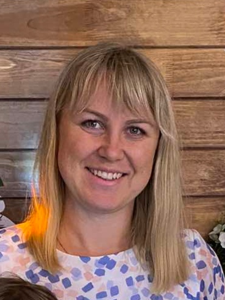

## **Ekaterina Baranova**


## Contact 
* phone: +375292778189
* email: kategaidyk@gmail.com
* address: Belarus, Vitebsk region
* Discord: BaranovaEK

## Summary:
The goal is to become an experienced web development professional. Why? Because I always liked to learn something new and aspecualy connected with computer technologys.

## Skills:
* VScode
* Adobe Photoshop
* git
* HTML

## Code example
### [8 kyu Multiply the number](https://www.codewars.com/kata/5708f682c69b48047b000e07)
```
function multiply(number){
  if (number > 0){
    return number * 5**(number.toString().length);   
  } else {
    return number * 5**(number.toString().length-1);
   }
}
```

## Education:
BGSHA ( 2005 - 2010 ) lawyer

## English:
* studying with a tutor
* Elementary 